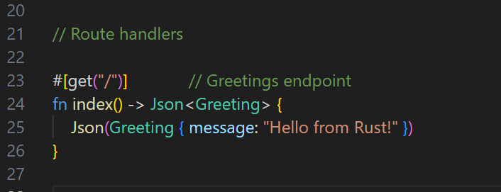
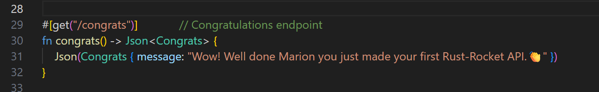
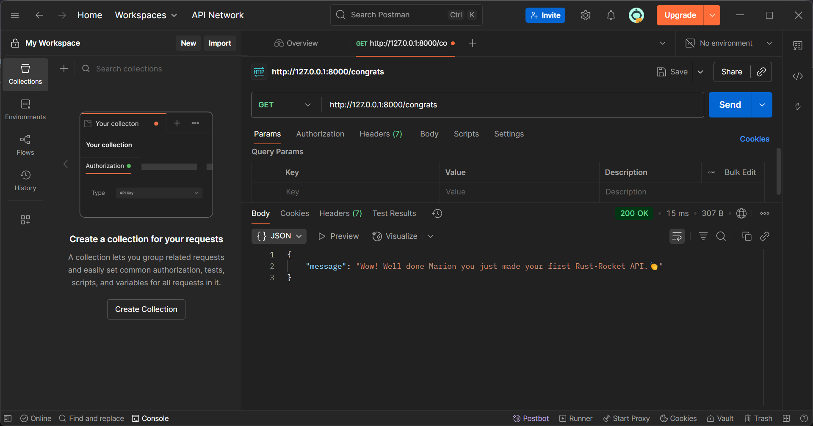
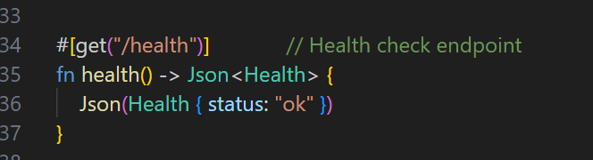
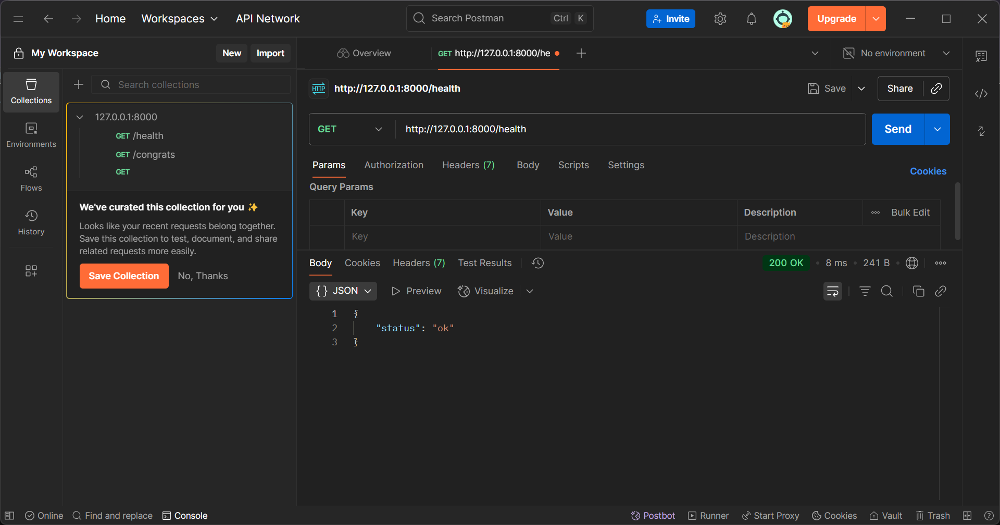

# Getting Started with Rust and Rocket - A Beginner's Guide

## 1️⃣ Title and Objective
**Title** - To build a minimal REST API in Rust using the Rocket web framework.

**Objectives** 
- `Learn Rust + Rocket using generative AI prompts.`

- `Create a minimal runnable API that returns JSON.`

-  `Document the entire process so a beginner can reproduce it, and reflect on the AI prompts used.`

**Why Rust?** 🤔
- Memory-safe systems programming without garbage collection
- Growing adoption in performance-critical applications
- Enables developers build fast, secure and reliable web services.

---

**What's the end goal?**
***To create a simple and minimalistic rust-rocket api with the following endpoints: Greetings, Congratulations and Status***

---


## 2️⃣ Quick Summary of the Technology
### What is Rust?

Rust is a modern systems programming language focused on safety, speed, and concurrency. It enforces memory safety without a garbage collector using its ownership model. Good for CLI tools, web servers, embedded, and high-performance systems. 


### What is Rocket? 

Rocket is a high-level web framework for Rust that makes it simple to write fast, type-safe, secure web applications with incredible usability, productivity and performance.

It makes routing and request handling ergonomic while integrating with Rust's type system.


### Real-word Example
Realtime chat application done by Eleftheria Batsou. 

Click the link below to check it out!

[Github](https://github.com/EleftheriaBatsou/chat-app-rocket-rust/tree/main)

---

## 3️⃣ System Requirements

- OS: 
    - Linux 
    - MacOS 
    - Windows (WSL)


- Tools: 
    - Rustup (for Rust toolchain)
    - Cargo (Rust package manager)
    - Curl (for testing), 
    

- Editor: 
    - VS Code or any text editor

---

## 4️⃣ Installation and Setup Instructions
### Install Rust
```bash
curl --proto '=https' --tlsv1.2 -sSf https://sh.rustup.rs | sh

# Read setup prompts and press Enter
```
```bash
# Run:
source $HOME/.cargo/env
```

### Verify Install
```bash
rustup show
rustc --version
cargo --version
``` 

### Create new project
```bash
cargo new rust-rocket-api

cd rust-rocket-api
```

### Add Rocket dependency
```bash
# Might need to install cargo-edit first
cargo install cargo-edit

cargo add rocket
```

***Alternatively edit cargo.toml manually but remember rocket evolves over time make sure to check out the latest version***
```bash
# Open file and add rocket crate under dependencies

[dependencies]
rocket = "0.5.1" 
```


### Run Project
```bash
cargo run  # Use eiither
cargo build
```

---

## 5️⃣ Minimal Working Example
**Examples -** Arust-rocket API with three endpoints:

- `GET /` - Returns a JSON greeting 

**Code**




**Expected Output**


---

- `GET /congrats` - Returns a JSON congratulations message

**Code**



**Expected Output**



---

- `GET /health` - Returns a simple health check

**Code**



**Expected Output**



---

## 6️⃣ AI Prompt Journal
### Learning a new programming language

#### Conceptual Understanding of Rust

[Link to the curriculum for the prompt](https://training.moringaschool.com/courses/2/pages/learning-a-new-programming-language-with-ai?module_item_id=66)


**Prompt**
```
I'm currently proficient in Python and Java and want to learn Rust. Before diving into code:

1. What are the key philosophical differences between Python, Java and Rust that I am trying to learn?

2. What key problems was Rust designed to solve?

3. What mental models should I adjust coming from both Python and Java?

4. What are common misconceptions do most developers have about Rust?
```

**AI Response**
```
1. Key Philosophical Differences

i) Python/Java approach: 
Handle complexity at runtime (garbage collection, dynamic features)

ii) Rust approach: 
Handle complexity at compile time (ownership system, type checking)

Result: If Rust code compiles, it's memory-safe and thread-safe with zero runtime overhead


2. Key Problems Rust Was Designed to Solve

a) Memory safety without garbage collection (no use-after-free, buffer overflows, null pointers)

b) Data race prevention through the type system

c) C/C++ performance with high-level safety guarantees


3. Mental Models to Adjust

From Python:
1) Ownership is explicit - Moving vs copying data matters (let y = x may invalidate x)

2) Immutable by default - Must use mut to allow changes

3) Compile-time checking - No dynamic typing or runtime flexibility

From Java:
1)No null - Use Option<T> to force explicit "nothing" handling

2) No inheritance - Traits (interfaces) + composition instead of class hierarchies

3) Memory layout matters - Stack vs heap (Box) is your responsibility

4) No garbage collector - Values drop when ownership ends (compiler enforces safety)

Core Concept:
Python/Java: You control what happens
Rust: You control what happens + who owns it + who can change it + when it dies


4. Common Misconceptions

i) "The borrow checker is just annoying"
Reality: It's encoding rules you should already be following in other languages, but those languages let you violate them and crash at runtime. The borrow checker is teaching you correct patterns.

ii) "Rust is only for systems programming"
Reality: While Rust excels at low-level work, it's increasingly used for web backends, CLIs, embedded systems, WebAssembly, and more. The safety guarantees are valuable everywhere.

iii) "You need to fight the compiler constantly"
Reality: Initially, yes. But experienced Rust developers rarely fight the compiler—they've internalized the ownership rules. The compiler becomes a helpful pair programmer.

iv) "Rust is just 'safer C++'"
Reality: Rust's design is fundamentally different. It's not C++ with training wheels—it's a new way of thinking about program correctness.


"Unsafe Rust is a trap door that undermines everything"
Reality: unsafe blocks are auditable, contained, and necessary for certain operations. They don't make Rust "as unsafe as C"—they let you build safe abstractions on unsafe foundations.
```

---

#### Language Fundamentals
**Prompt**

```
Prerequisite: Basic programming knowledge in Python and Java

Learning Steps:
1. Rust syntax basics and differences from Python and Java

2.  Understanding static typing vs. dynamic typing

3. Rust variable declarations and primitive types as well as function declarations

4. Control structures and how they differ from Python and Java

Verification: Write a simple program converting a Python/Java  script to Rust
```

**AI Response(Summary -> Just Part 1)**
```
1. Rust Syntax Basics and Differences
Key Syntax Differences

Python:
def greet(name):
    message = f"Hello, {name}!"
    return message

Java:
public String greet(String name) {
    String message = "Hello, " + name + "!";
    return message;
}

Rust:
fn greet(name: &str) -> String {
    let message = format!("Hello, {}!", name);
    message  // or: return message;
}


Notable differences:

fn keyword for functions (not def or type declarations)

Type annotations come after variable/parameter names: name: &str

Return type specified with -> arrow

No semicolon on last expression means it's returned (implicit return)

Curly braces are mandatory (even for single statements)

format! macro uses ! to indicate macro invocation
```
---


#### Deepening Knowledge of current language

[Link to curriculum for the prompt](https://training.moringaschool.com/courses/2/pages/deepening-knowledge-of-your-current-programming-language?module_item_id=65)

**Prompt**

```
I want to improve my understanding of routing and request  handling in rust.

1. Could you explain this feature with simple examples?

2. Show me 3 practical use cases where this would be valuable

3. Provide a small project idea that would help me practice this feature

4. What common mistakes should I avoid when using this feature?
```

**AI Response**
```
Routing and Request Handling in Rust

1. Simple Explanation with Examples

rust#[macro_use] extern crate rocket;

#[get("/add/<a>/<b>")]
fn add(a: i32, b: i32) -> String {
    format!("{} + {} = {}", a, b, a + b)
}

#[get("/multiply/<a>/<b>")]
fn multiply(a: i32, b: i32) -> String {
    format!("{} × {} = {}", a, b, a * b)
}

#[launch]
fn rocket() -> _ {
    rocket::build().mount("/", routes![add, multiply])
}


What is a Route?
A route is a connection between a URL path and a function that handles requests to that path. Think of it like a phone directory - when someone calls a specific number (URL), the call gets directed to the right person (handler function). In web applications, routes tell the server "when someone visits this URL with this HTTP method, run this specific function and send back the response."
Understanding the Syntax

#[macro_use] extern crate rocket; brings in Rocket's special macros that make routing work


#[get("/add/<a>/<b>")] is a route attribute that sits above the add function


The #[get(...)] part tells Rocket "this is a GET request handler"


The "/add/<a>/<b>" part defines the URL pattern where <a> and <b> are dynamic placeholders that capture values from the URL


The function signature fn add(a: i32, b: i32) -> String receives those captured URL values as parameters, automatically converted to i32 integers


#[launch] marks the entry point of your application


rocket::build() creates a new Rocket server instance


.mount("/", routes![add, multiply]) registers both route handlers at the base path "/" - this mounting step connects your handler functions to the running web server
```

---

**Your evaluation of its helpfulness**
```
By prioritizing understanding over code snippets and using my exisiting knowledge of python and java as anchors for new concepts, I was able to grasp rust syntax to come up with a simple rust-rocket api. 

However just learning the basics wasn't enough to build this application, I dived deeper into learning and understanding the routing feature in rust. With the help of AI and of course using mulitple prompts and refining them each time I hit a dead end, I was able to get desirable results and help thus improving my productivity and clarity on something I would have spent hours learning on my own 
```
---

## 7️⃣ Common Issues and fixes

**What Initially didn't work for me**

- rustup not installed / cargo not found

```
Fix: Install rustup from https://rustup.rs and restart shell.
```


- Rocket compilation complaining about features or edition

```
Ensure edition = "2024" in Cargo.toml.

Add features = ["json"] to Rocket in Cargo.toml.

Run rustup update to ensure toolchain is modern.
```


- Slow first build

```
The first cargo run compiles dependencies; subsequent runs are faster.
```

**Other errors I got and how I resolved them**

- Port in use / cannot bind

```
Either shut the program using the port or run Rocket on a different port using env var, e.g.: ROCKET_PORT=8001 cargo run or the config file.
```


- Dependency version mismatch

```
Run cargo update or change dependency version in Cargo.toml to match latest Rocket release as per https://rocket.rs.
```


- serde::Serialize not found

```
Ensure serde = { version = "1.0", features = ["derive"] } in Cargo.toml and use 
rocket::serde::Serialize; if using Rocket's re-export or use serde::Serialize; for direct serde.
```
**Links I used to fix issues**.

[Help](https://users.rust-lang.org/t/help-to-fix-serialize-not-implemented-for-std-error/104921) and 
[Help](https://medium.com/@murataslan1/serialization-and-deserialization-in-rust-a-comprehensive-guide-3eb249ae8ac6)

---

## 8️⃣ References
[Rust Official Website](https://www.rust-lang.org)

[Rocket Official Website](https://rocket.rs)

[Serde](https://serde.rs)

[Claude Gen AI](https://claude.ai/new)